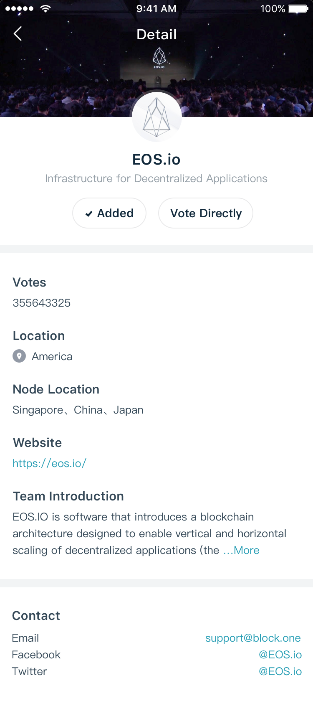
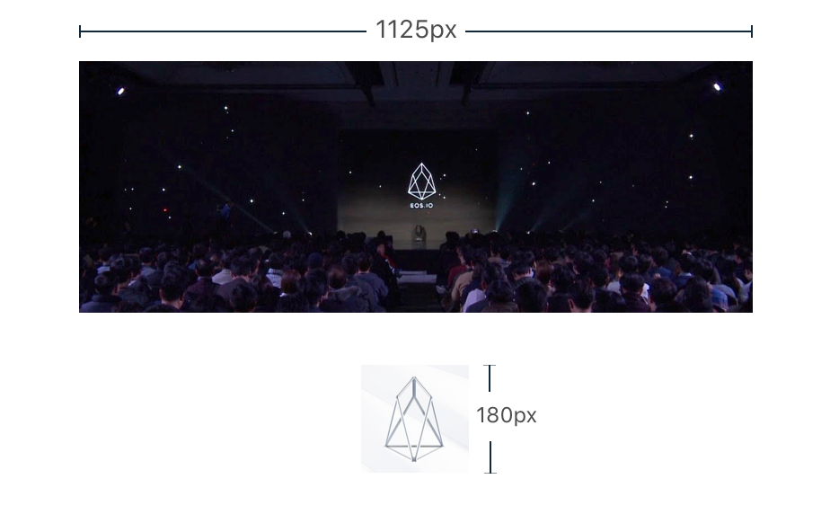

# EOS BP Profile


The purpose of the repo is to make users know more about EOS block producer info. BP info display example: 



## How to contribute

1. Fork the repo to your account
2. Clone the repo from your own account, rather than the origin one
```
git clone git@github.com:xxxxxxxx/eos-bp-profile.git
```
3. Create and switch to a new branch named by your bp account name
4. Add a new json file to the `bp` directory, which named by the EOS bp account name, for example:  
```
imtoken.json
```
5. Fulfill the content by following the schema of [$template.json](./bp/$template.json)
6. Add the bp logo and cover to `images` directory, which named by the EOS bp account name, for example:  
```
logo-$account_name.png
cover-$account_name.png
```
7. Push to your own repo
8. Make a pull request with detailed description
9. We will review your PR as soon as possible, and then merge it into the master branch when everything is fine


## Images design 
- logo size: 180x180 png
- cover size: 1125x420 png




## Copyright

2018&copy;imToken PTE. LTD.